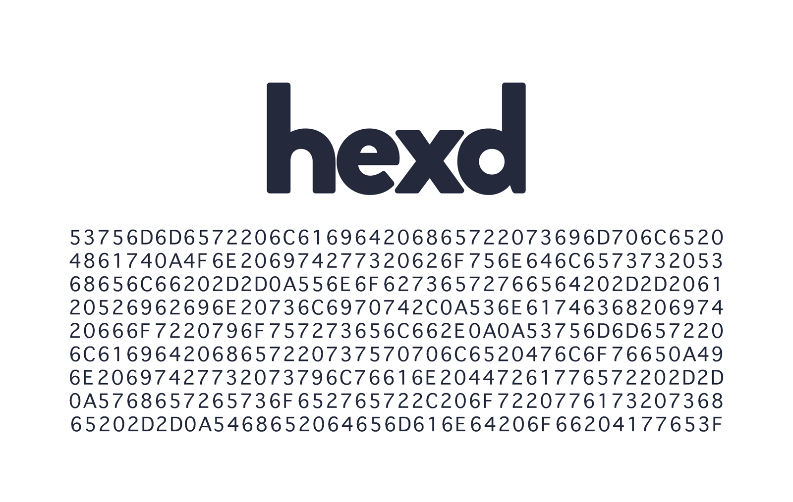

<p align="center">
  </a>
  <br><br>
</p>

## What's included

Three wonderfully amazing functions.

```go
hexd.Dump(b []byte) []byte
hexd.DumpString(b []byte) string
hexd.WriteTo(w io.Writer, b []byte) (n int, err error)
```

## Installing

To start using `hexd`, install Go and run go get:

```
$ go get -u github.com/tidwall/hexd
```

This will retrieve the library.

## Usage

Imagine for a moment that the variable `bigolebunchofdata` contains something great, such as a raw sqlite database.

```go
hex := hexd.DumpString(bigolebunchofdata)
println(hex)
```

This would output something that looks like:

```
0000000000  53 51 4C 69 74 65 20 66 6F 72 6D 61 74 20 33 00  SQLite format 3.
0000000010  04 00 01 01 00 40 20 20 00 00 00 19 00 00 03 60  .....@  .......`
0000000020  00 00 00 00 00 00 00 00 00 00 00 22 00 00 00 01  ..........."....
0000000030  00 00 00 00 00 00 00 00 00 00 00 01 00 00 00 00  ................
0000000040  00 00 00 00 00 00 00 00 00 00 00 00 00 00 00 00  ................
0000000050  00 00 00 00 00 00 00 00 00 00 00 00 00 00 00 19  ................
0000000060  00 2D E2 1E 05 00 00 00 07 03 DD 00 00 00 00 19  .-â.......Ý.....
0000000070  03 FB 03 F6 03 F1 03 EC 03 E7 03 E2 03 DD 00 00  .û.ö.ñ.ì.ç.â.Ý..
0000000080  00 00 00 00 00 00 00 00 00 00 00 00 00 00 00 00  ................
0000000090  00 00 00 00 00 00 00 00 00 00 00 00 00 00 00 00  ................
00000000a0  00 00 84 62 04 07 17 1F 1F 01 89 13 74 61 62 6C  .. b...... .tabl
00000000b0  65 63 75 73 74 6F 6D 65 72 73 63 75 73 74 6F 6D  ecustomerscustom
00000000c0  65 72 73 05 43 52 45 41 54 45 20 54 41 42 4C 45  ers.CREATE TABLE
00000000d0  20 22 63 75 73 74 6F 6D 65 72 73 22 0D 0A 28 0D   "customers"..(.
00000000e0  0A 20 20 20 20 5B 43 75 73 74 6F 6D 65 72 49 64  .    [CustomerId
00000000f0  5D 20 49 4E 54 45 47 45 52 20 50 52 49 4D 41 52  ] INTEGER PRIMAR
0000000100  59 20 4B 45 59 20 41 55 54 4F 49 4E 43 52 45 4D  Y KEY AUTOINCREM
0000000110  45 4E 54 20 4E 4F 54 20 4E 55 4C 4C 2C 0D 0A 20  ENT NOT NULL,..
```

Nice!

## But why?

> Gee whiskers Josh, the Go stdlib package already has the [`hex.Dumper`](https://golang.org/pkg/encoding/hex/#Dumper). Why you reinvent'n the wheel?

- Mostly just because.
- But also, the outputs are slightly different. `hex.Dumper` is designed to look like `hexdump -C`. `hexd` is intended to look like more like my old favorite hex editor [`Hex Workshop`](http://www.hexworkshop.com/overview.html).  
- Finally, the `hexd` api is made specifically for the kind of printf debugging that I like.

## Documentation

https://godoc.org/github.com/tidwall/hexd

## License

`hexd` source code is available under the ISC License.
